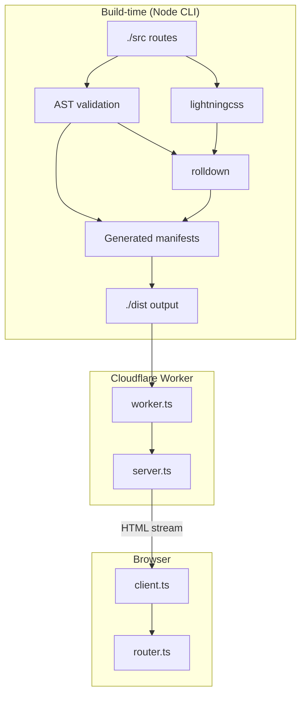
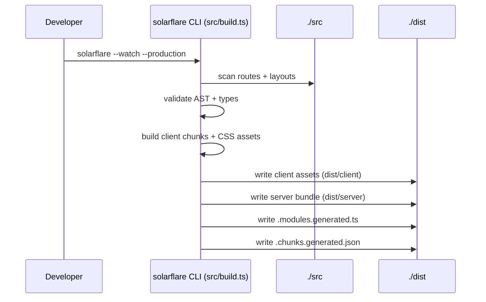
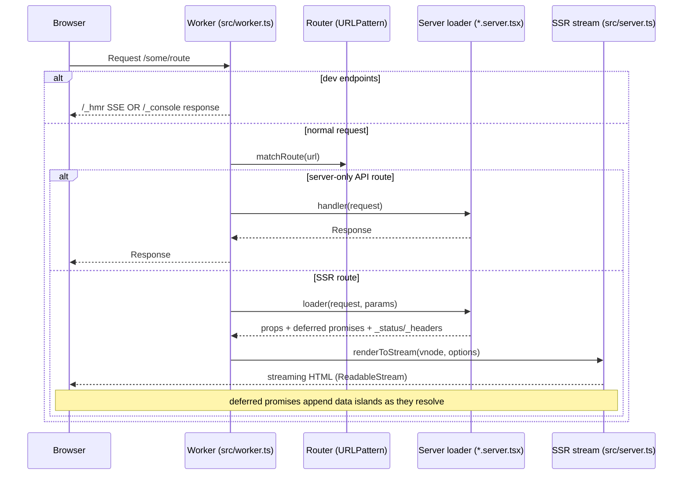
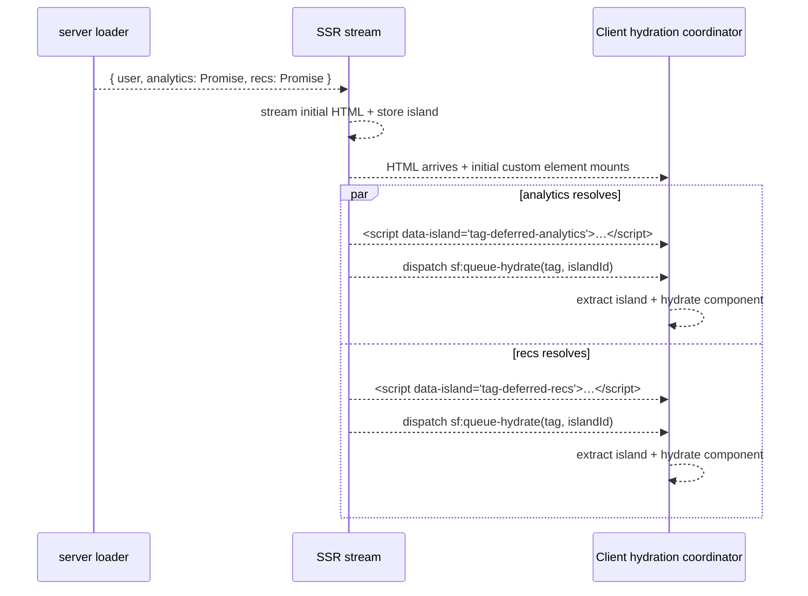
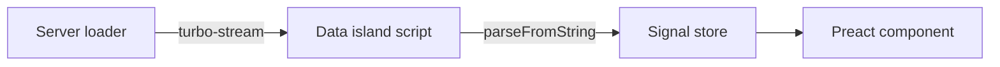
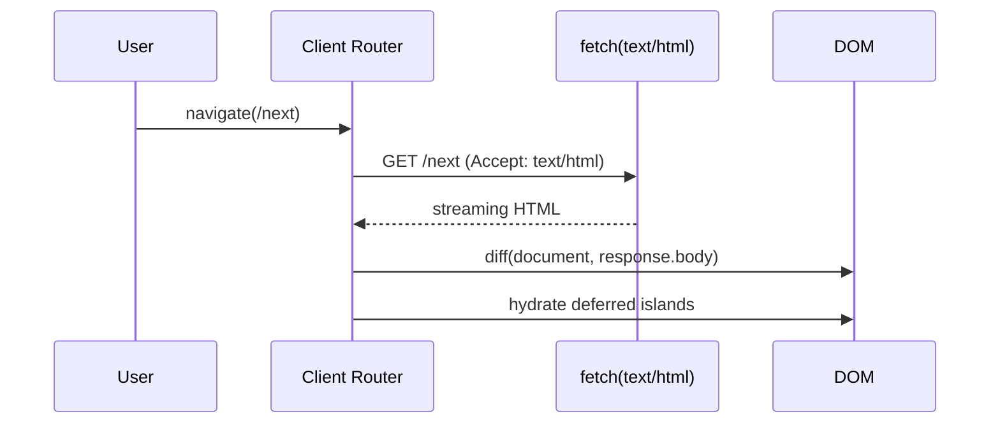
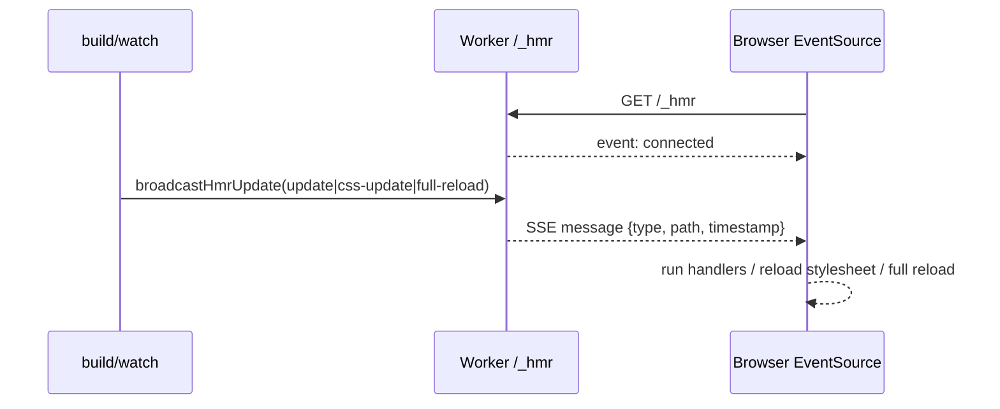

# Architecture

Solarflare is a Cloudflare-Workers-first meta-framework for streaming SSR + SPA navigation, built on web platform primitives (Fetch, Streams, URLPattern) while keeping JSX ergonomics via Preact.

This document explains how the build step produces a runtime “manifest”, and how requests flow through the Worker → SSR stream → client hydration/router.

## High-level shape

- **Build-time (Node.js CLI)**: scans `src/` route files and produces `dist/` output plus generated manifests.
- **Runtime (Cloudflare Worker)**: matches routes, runs optional server loaders, streams HTML, and appends deferred data islands.
- **Client runtime (browser)**: hydrates a small store + head state, registers route components as custom elements, performs SPA navigations, and hydrates deferred islands as they arrive.



## Repository modules (mental model)

- **Worker entrypoint**: `src/worker.ts`
  - Uses generated build artifacts `.modules.generated` (emitted as `.modules.generated.ts`) and `.chunks.generated.json`.
  - Implements routing, streaming SSR, caching, and dev endpoints (`/_hmr`, `/_console`, devtools JSON).

- **SSR renderer**: `src/server.ts`
  - Creates a per-request store/head context.
  - Renders Preact VNodes to a `ReadableStream`.
  - Injects `<head>` and asset tags during streaming.
  - Streams _deferred promise props_ as independent “data islands”.
  - Uses `src/runtime.ts` for shared global state.

- **Client runtime**: `src/client.ts`, `src/router.ts`, `src/store.ts`
  - `initClient()` hydrates store + head state and sets up hydration coordination.
  - SPA router fetches HTML, DOM-diffs it in, then hydrates deferred islands.
  - APIs: `Deferred` (`src/render-priority.ts`) for priority-based rendering holes, `define()` for custom elements.

- **Styles & CSS**:
  - `src/stylesheets.ts` & `src/client-styles.ts`: Manage Constructable Stylesheets.
  - `src/hmr-styles.ts`: Handles granular CSS HMR updates.
  - `src/critical-css.ts`: Extracts critical CSS for inlining.

- **Speculation Rules**: `src/speculation-rules.ts`
  - Prefetch/prerender via Speculation Rules API.
  - Helpers: `injectSpeculationRules`, `buildRouteSpeculationRules`, `renderSpeculationRulesTag`.
  - Meta tag integration via `buildSpeculationRulesFromConfig` in `worker-config.ts`.

- **Performance Features**:
  - `src/early-flush.ts`: Sends initial HTML shell immediately.
  - `src/early-hints.ts`: Sends 103 Early Hints headers.
  - `src/route-cache.ts`: Edge caching logic for server routes.

- **DX / Dev mode**
  - HMR client: `src/hmr-client.ts` (EventSource → `/_hmr`)
  - HMR utilities + error boundary: `src/hmr.ts`
  - HMR server endpoint: `src/hmr-server.ts` (`/_hmr` SSE)
  - Console forwarding: `src/console-forward.ts` (`/_console` + injected `console-forward.js`)
  - Codemod: `src/codemod.ts` (CLI tool for migration)

## Key dependencies

| Package                          | Purpose                                    |
| -------------------------------- | ------------------------------------------ |
| `preact`                         | JSX rendering (3KB alternative to React)   |
| `preact-render-to-string/stream` | Streaming SSR                              |
| `preact-custom-element`          | Register components as web components      |
| `@preact/signals`                | Reactive state (store, params, serverData) |
| `turbo-stream`                   | Serialize complex data types for hydration |
| `rolldown`                       | Fast Rust-based bundler                    |
| `lightningcss`                   | CSS minification and transforms            |

## Build-time architecture

Solarflare’s CLI (the package `bin`) is implemented in `src/build.ts`. Conceptually it does:

1. **Scan** for route/layout files using naming conventions:
   - `*.client.tsx` client components (registered as custom elements)
   - `*.server.tsx` server loaders/handlers
   - `_layout.tsx` layout wrappers
   - `_error.tsx` error boundary page
   - `/_*` reserved for internal framework paths

2. **Validate** modules using TypeScript + AST rules (shape of default exports, etc.).

3. **Bundle** client entries with per-route code splitting.

4. **Emit manifests** used by the Worker at runtime:
   - `dist/.modules.generated.ts`: typed dynamic-import map of discovered modules.
   - `dist/.chunks.generated.json`: route tag → script chunk + per-route styles + dev scripts.



## Runtime: request lifecycle (Worker → SSR stream)

At runtime, the Cloudflare Worker is the single entrypoint.

Key steps (simplified):

1. **Dev endpoints** short-circuit early:
   - `/_hmr` → SSE stream (`src/hmr-server.ts`)
   - `/_console` → console forwarding (`src/console-forward.ts`)
   - devtools JSON → `src/devtools-json.ts`

2. **Route match** using `URLPattern` against generated routes.

3. **Server loader (optional)**
   - If a `*.server.tsx` module is paired with a `*.client.tsx`, its default export is invoked to compute props.
   - Underscore-prefixed keys (e.g. `_headers`, `_status`) become response metadata.
   - Promise-valued props are treated as **deferred** and streamed independently.

4. **Render**
   - The client component is wrapped in its custom-element tag.
   - Layouts are applied (root → leaf).
   - The SSR stream injects:
     - `<head>` content at the `<Head />` marker
     - script/style tags + store hydration data at the `<Body />` marker

5. **Performance features (optional)**
   - **Early hints**: `Link:` header from meta-driven resource hints.
   - **Early flush**: send a static shell immediately and stream content after.
   - **Critical CSS**: inline a size-bounded subset of CSS when enabled.
   - **Route cache**: `withCache(...)` caches rendered responses based on meta config.
   - **Speculation rules**: prefetch/prerender via `<script type="speculationrules">`.



## Streaming + deferred promise props

Solarflare supports “deferred streaming” of promise-valued loader props:

- The first HTML bytes are sent as soon as the SSR stream starts.
- Each deferred promise resolves independently.
- When a promise resolves, the server appends a **data island** script tag and a small script that dispatches `sf:queue-hydrate`.
- On the client, the hydration coordinator picks up the event and hydrates the relevant custom element with the new data.



## State management: signals + data islands

Solarflare uses `@preact/signals` for reactive state:

- **`params`** — current route parameters (read-only signal)
- **`serverData`** — data from server loader (read-only signal)
- **`pathname`** — current URL pathname (read-only signal)

### Hydration flow

1. Server serializes store state via `turbo-stream` into a `<script type="application/json" data-island="sf-store">` tag.
2. Client calls `hydrateStore()` to parse and initialize signals.
3. Deferred data arrives as separate islands (`<script data-island="tag-deferred-key">`).
4. The hydration coordinator (`src/store.ts`) processes `sf:queue-hydrate` events sequentially.



## Client runtime: hydration + SPA navigation

### Initial load

- `initClient()` (from `src/client.ts`) sets up:
  - head context + head hoisting
  - store hydration (`sf-store` data island)
  - hydration coordinator for deferred islands

### Web component registration

Client components are registered as custom elements via `preact-custom-element`:

```tsx
// Generated entry wraps your component
register(Component, "blog-post", ["title", "slug"], { shadow: false });
```

The `define()` helper (exported from `@chr33s/solarflare/client`) provides a declarative alternative with validation.

### SPA navigation

The router (`src/router.ts`) is a DOM-diffing SPA router:

1. Intercepts navigation (Navigation API when available).
2. Fetches the next document as HTML.
3. Optionally uses View Transitions.
4. Applies a streaming DOM diff (`diff-dom-streaming`).
5. Hydrates any deferred data islands present in the new HTML.



## Dev mode: HMR + console forwarding

### HMR

- Server side: `/_hmr` is an SSE endpoint (`src/hmr-server.ts`).
- Client side: `src/hmr-client.ts` connects via `EventSource` and dispatches HMR events.
- Component-level helpers in `src/hmr.ts` preserve hook state, scroll position, and isolate failures via `HMRErrorBoundary`.



### Console forwarding

In dev builds, the build step emits `dist/client/console-forward.js` and the chunk manifest lists it as a dev script. The Worker injects it into rendered HTML so browser logs can be forwarded to the dev server route.

## Key invariants / constraints

| Constraint          | Details                                                                    |
| ------------------- | -------------------------------------------------------------------------- |
| Workers environment | Runtime targets Cloudflare Workers + web APIs (Streams, Fetch, URLPattern) |
| File-based routing  | `_` prefix = private, `/_*` = reserved, `$param` = dynamic segment         |
| Streaming-first SSR | Avoid `Promise.all` when you want independent per-promise streaming        |
| Custom elements     | Components must produce valid tags (lowercase, contains hyphen)            |
| Hydration order     | Deferred islands hydrate sequentially via `sf:queue-hydrate`               |

## Troubleshooting guide

| Symptom                    | Where to look                                                                             |
| -------------------------- | ----------------------------------------------------------------------------------------- |
| Route not found            | Check file naming (`*.client.tsx`), verify no `_` prefix, inspect `.modules.generated.ts` |
| Hydration mismatch         | Compare SSR HTML vs client render; check signal initialization order                      |
| Deferred data missing      | Confirm promise is returned (not awaited) from server loader                              |
| HMR not updating           | Check `/_hmr` SSE connection in Network tab; verify `broadcastHmrUpdate` called           |
| Styles not loading         | Inspect `.chunks.generated.json` for correct style paths                                  |
| Custom element not defined | Ensure client chunk loads before element is inserted (check `entry.chunk` preload)        |
